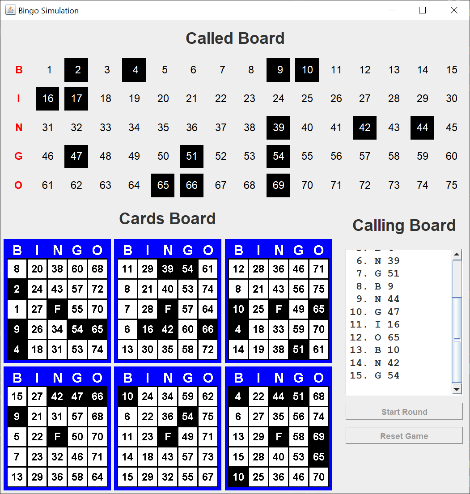

# Bingo Simulation

## Introduction

A couple of days ago on Stack Overflow, someone mentioned a Bingo game they were trying to create.  After a while, I realized that I hadn't ever created a Bingo game.  I thought it might be a good example of a complex Swing GUI.  It turns out, i was right.

Here's what the GUI looks like when you start it.

It wound up being an almost square GUI at 714 x 743 pixels.

The game of Bingo consists of 75 numbers, usually on balls in a physical game, from 1 through 75.  Each Bingo card consists of 24 numbers picked at random from those 75 numbers and a free space in the center of the card.  To make the game a little easier, the 75 numbers are divided into 5 groups of 15 numbers.  The groups are designated by the letters B, I, N, G, and O.  As you can see on a Bingo card, the card numbers are taken from each of the five groups.

Each person playing can have as many Bingo cards as they can handle.  I've seen people play as many as 12 cards.  In the GUI, six cards fit, so that's what I went with.

Each number, or ball, is called in a random order.  In a physical game, the balls are inside a large metal ball that rotates and dispenses the balls one at a time in a random order.

The object of the basic game is to mark five called numbers on your card, including the free space, in a row, column, or diagonal.  This is called a Bingo.  The first person or persons to get a Bingo wins the round.  Because of the number of cards in play, it's possible for more than one person to win a round.

Since this is a computer simulation, I added a four corners Bingo.  Other variations of the game can be played, including a blackout where all the numbers on the card have to be called.

Here's the GUI after a few numbers have been called.

And here's the GUI after one of the cards has a Bingo.  The Bingo is marked in green.

The GUI displays the numbers called in two different ways.  The called board displays the numbers in numerical order.  This allows people to easily check their Bingo cards to verify that they haven't missed a number.  The calling board displayes the numbers in the order that they were drawn.  This allows a person to "call" the numbers so that everyone can check their cards.

The Bingo simulation runs at a rate of a drawn number every 4 seconds.  This is fast enough for a simulation, but slow enough that you can see the individual numbers appear on the various parts of the GUI.

## Explanation

If you’re not familiar with Java Swing, Oracle has an excellent tutorial to get you started, [Creating a GUI With JFC/Swing](https://docs.oracle.com/javase/tutorial/uiswing/index.html). Skip the Netbeans section.

Whenever I create a Swing GUI, I use the [model / view / controller](https://en.wikipedia.org/wiki/Model%E2%80%93view%E2%80%93controller) (MVC) pattern.  This pattern allows me to more easily separate my concerns and focus on one part of the Swing application at a time.

I create a logical model of the game using one or more plain Java getter / setter classes.  For this particular Swing application, I created two model classes.

The view consists of a JFrame and many JPanels.

The controller consists of as many listener classes as you need to perform the GUI functions.  Generally, these classes are independent of each other.  There's usually no need for a "master" controller class to rule them all.

The reason it's called the MVC pattern is you create the model first, then the view, then the controller.  This is usually not a waterfall process.  You create as much of the model as you can think of, then when you're working on the view, you realize that some pieces of the model are missing.  Even when you're writing controller classes, you can still discover missing pieces of the model.

To summarize, in a Swing application, the MVC pattern looks like this:

1.  The view reads information from the model.
2.  The view does not update the model.
3.  The controller updates the model and repaints / revalidates the view.

### Model

I created two model classes, Card and BingoModel.  The Card class, representing one Bingo card, holds an int array of 15 numbers, and a boolean array to indicate whether the number has been called.  Yes, I should have wrote a third class holding one number and one called boolean.  I didn't discover that I needed the called booleans until late in the development, so I went with parallel arrays.

The BingoModel class holds an int array of the 75 numbers, a List of Integer called numbers, and a List of Card instances.  This is the logical model of the Bingo simulation.

### View

I created two view classes, BingoFrame and BingoCard.  The BingoFrame class holds the one JFrame and all of the JPanels that make up this GUI.  There were more JPanels in this GUI than I can count.  I probably should have broken out the BingoFrame class into multiple classes.

The BingoCard class is a drawing JPanel.  I saw some Bingo card images online, and decided that rather than use an image, I'd paint the entire Bingo card.  I probably spent most of my development time on this one class.

For a long time during development, I wasn't sure what I wanted the GUI to look like, so I spent a lot of time experimenting with different layouts and [Swing layout managers](https://docs.oracle.com/javase/tutorial/uiswing/layout/visual.html).  I tried to keep subordinate JPanels in their own methods so I could mix and match them.  Generally, each main subordinate JPanel should be created in its own method, or its own class.

### Controller

I wrote three controller classes for two JButtons.  One controller class, BallListener, is the ActionListener for the Swing Timer that animates the drawing of the Bingo numbers.  The controller classes disable and enable the JButtons to keep the user from pressing the wrong button at the wrong time.

The BallListener class has an interesting "trick".  I needed an instance of the Timer inside the BallListener class so I could stop the Timer when one or more of the Bingo cards has a Bingo, but I have to pass the constructor of the BallListener class when I create the Timer instance.  To get around this paradox, I created a separate setter for the Timer instance.  That way, I could create the timer and construct the BallListener class and pass the Timer instance to the class before the ActionPerformed method was triggered.
